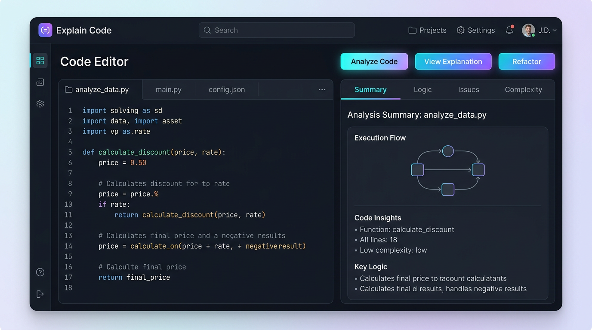

# Explain Code

<p align="center">
  
</p>

Full-stack app that sends your source to **Google Gemini** via a **Python (FastAPI)** backend and shows structured results in a **Next.js** UI: high-level summary, logic explanation, bug-style findings with severity, and time/space complexity notes.

## Prerequisites

- Node.js 20+ and npm
- Python 3.10+ with `pip`
- A [Gemini API key](https://aistudio.google.com/apikey) (Google AI Studio)

## Backend (Python)

```bash
cd backend
python -m venv .venv
# Windows: .venv\Scripts\activate
# macOS/Linux: source .venv/bin/activate
pip install -r requirements.txt
copy .env.example .env
```

Edit `backend/.env` and set `GEMINI_API_KEY`. Optionally change `GEMINI_MODEL` (for example `gemini-2.5-flash` or `gemini-1.5-flash`).

**Activate the venv** (pick the shell you use):

- **PowerShell (Windows):** `.\.venv\Scripts\Activate.ps1`
- **cmd.exe (Windows):** `.venv\Scripts\activate.bat`
- **Git Bash (Windows):** use forward slashes — `source .venv/Scripts/activate`  
  (Do not use `.venv\Scripts\activate` in Bash; backslashes break and you may see `.venvScriptsactivate: command not found`.)

**Run the API** (after `cd backend`):

```bash
uvicorn main:app --reload --host 127.0.0.1 --port 8000
```

Or without activating (works in any shell). **Git Bash:** use forward slashes only — do **not** use `.\.venv\...` (Bash turns that into garbage like `..venvScriptspython.exe`):

```bash
.venv/Scripts/python.exe -m uvicorn main:app --reload --host 127.0.0.1 --port 8000
```

From `backend/`, you can also run: `bash run-dev.sh`

- API: `POST /api/analyze` with JSON body `{ "code": "...", "language": "python" }` (this is **not** a WhatsApp webhook payload).
- WhatsApp: `POST /api/webhooks/whatsapp` for Meta’s JSON (`entry` / `messages` / `text.body`). Use `GET /api/webhooks/whatsapp?hub.mode=subscribe&hub.verify_token=...&hub.challenge=...` for verification.
- Health: `GET /health`

**Postman:** for code analysis, set **POST** `http://127.0.0.1:8000/api/analyze`, Body → raw → JSON, for example:

```json
{ "code": "def f(): return 1", "language": "python" }
```

If you send WhatsApp webhook JSON to `/api/analyze`, FastAPI returns **422** (missing `code`) — that is expected.

## Frontend (Next.js)

```bash
cd frontend
npm install
copy env.sample .env.local
```

Adjust `NEXT_PUBLIC_API_URL` in `.env.local` if the API is not on `http://127.0.0.1:8000`.

```bash
npm run dev
```

Open [http://localhost:3000](http://localhost:3000).

## How traffic flows (ports vs Google)

- **Port 3000** — Next.js dev server in your browser.
- **Port 8000** — FastAPI; the browser calls `http://127.0.0.1:8000/api/analyze` (see `NEXT_PUBLIC_API_URL` in `frontend/.env.local`).
- **Google** — Only your **Python backend** calls `generativelanguage.googleapis.com` using the API key. **Google does not see port 3000 or 8000**; those are only on your machine.

If **Analyze** works but **Google AI Studio** does not show each request, that is expected: the Studio UI is mainly for **Playground / chat**, not a full log of every **REST/SDK** call. Usage is usually visible under **Google Cloud Console** → **APIs & Services** → **Generative Language API** → **Metrics** / **Quotas** (for the GCP project tied to that API key).

To confirm the backend really reaches Google, open (with the API running):

`http://127.0.0.1:8000/api/gemini-live-check`

You should see JSON with `ok: true` and a list of model ids. That call uses the same key as `/api/analyze`.

## Security note

Keep your Gemini key only in `backend/.env` (server-side). Do not put it in the Next.js app or commit it.

If you see **API_KEY_INVALID** from Google, the key is rejected before the model runs. Common fixes: create a new key in [Google AI Studio](https://aistudio.google.com/apikey); ensure `GEMINI_API_KEY=` has **no space** after `=`; in [Google Cloud Console](https://console.cloud.google.com/apis/credentials) open the key and set **Application restrictions** to **None** for local dev (HTTP referrer restrictions block server-side Python). Under **API restrictions**, use **Don’t restrict key** or enable **Generative Language API**.
